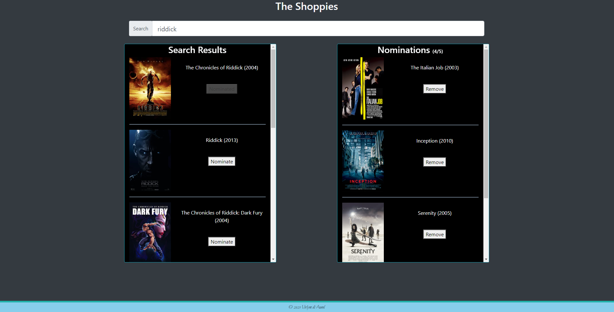

# **shopify-movies**
  
  
  
  ## **Description**
  
Shopify has branched out into movie award shows and we need your help. Please build us an app to help manage our movie nominations for the upcoming Shoppies.

#### **The Challenge**

We need a webpage that can search OMDB for movies, and allow the user to save their favourite films they feel should be up for nomination. When they've selected 5 nominees they should be notified they're finished.

We'd like a simple to use interface that makes it easy to:
* Search OMDB and display the results (movies only)
* Add a movie from the search results to our nomination list
* View the list of films already nominated
* Remove a nominee from the nomination list

#### **Technical requirements**
1. Search results should come from OMDB's API (free API key: http://www.omdbapi.com/apikey.aspx).
2. Each search result should list at least its title, year of release and a button to nominate that film.
3. Updates to the search terms should update the result list
4. Movies in search results can be added and removed from the nomination list.
5. If a search result has already been nominated, disable its nominate button.
6. Display a banner when the user has 5 nominations.

  <br><br>
  
  ## **Table of Contents**
  
  * [Installation](#Installation)
  * [Usage](#Usage)
  * [License](#License)
  * [Contributing](#Contributing)
  * [Technology](#Technology)
  * [Questions](#Questions)
  
  <br><br>
  
  ## **Installation**
  
  1. Clone the repo
  ```sh
  git clone https://github.com/virlym/shopify-movies.git
  ``` 
  2. Install NPM packages
  ```sh
  npm install
  ```
  <br><br>
  
  ## **Usage**
  [Deployed link](https://shopify-movies.herokuapp.com/)

  
  
  <br><br>
  
  ## **License**
  
  Distributed under the MIT License.
  <br><br>
  
  ## **Contributing**
  Contributions are what make the open source community such an amazing place to be learn, inspire, and create. Any contributions you make are **greatly appreciated**.
  
  1. Fork the Project
  2. Create your Feature Branch (`git checkout -b feature/AmazingFeature`)
  3. Commit your Changes (`git commit -m 'Add some AmazingFeature'`)
  4. Push to the Branch (`git push origin feature/AmazingFeature`)
  5. Open a Pull Request
  
  <br><br>
  
  ## **Technology**
  - [JavaScript](https://www.javascript.com/)
  - [React.js](https://reactjs.org/)
  - [npm Axios](https://www.npmjs.com/package/axios)
  - [npm React Helmet](https://www.npmjs.com/package/react-helmet)
  - [Bootstrap](https://react-bootstrap.github.io/getting-started/introduction)
  <br><br>
  
  ## **Questions**
  Learn about more of my work at [my GitHub](https://github.com/virlym)
  
  You can send any additional questions to my email : virlym@gmail.com
  <br><br><br><br>